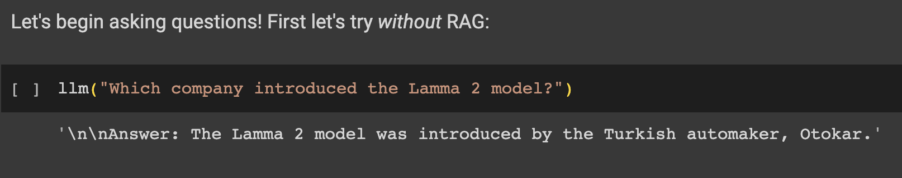
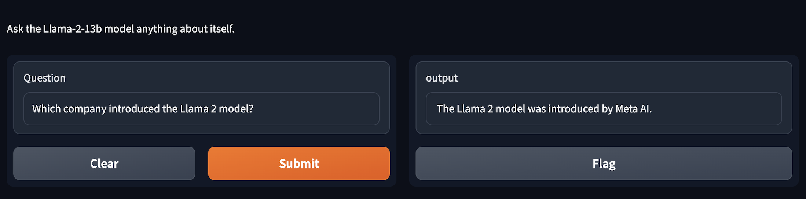

# Retrieval Augmented Generation on Llama-2-13b

RAG on Llama-2-13B to answer questions about itself.

Llama-2 is one of the state-of-the-art Large Language Models. 
In this project, I have implemented the Llama-2 model to retrieve information about itself and answer user queries.

Steps:

- Encode the Llama-2 paper into a vector representation and store it in a vector database (Pinecone).
- When a question is asked, retrieve the most relevant part from the vector database.
- Augment the input question with the retrieved part of the documents.
- Pass the augmented question to a Llama-2 model to generate the output answer.

---

# Results:

### <u>Before Applying RAG</u>:

### <u>After Applying RAG</u>:

---

As of now, I have been using the Llama-2 paper as a PDF. 
However, we can pass any information from various types of documents to make the model aware of specific topics. 
This approach can address a common issue with many language models: their lack of awareness of recent topics.
